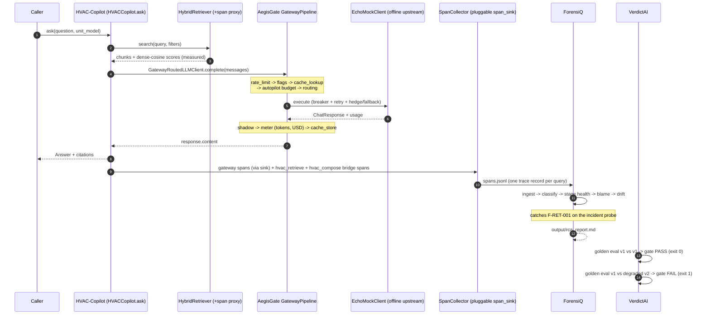

# PlatformDemo

[](brag-output/brag.mp4)


The vertical integration proof for the AI portfolio: [AegisGate](https://github.com/AkshayJohn03/AegisGate), [HVAC-Copilot](https://github.com/AkshayJohn03/HVAC-Copilot), [ForensiQ](https://github.com/AkshayJohn03/ForensiQ) and [VerdictAI](https://github.com/AkshayJohn03/VerdictAI) — four standalone systems, one end-to-end run, fully offline.

---

## For everyone: what is this?

🟢 Each portfolio repo ships alone. This repo is the **picture on the box, finally assembled**: it takes a real technician question through the whole platform and shows every system doing its actual job — not a diagram, not a claim. One command runs it on a laptop with no internet, no API keys, no services:

```bash
python demo/pipeline_demo.py
```

The story in one paragraph: a field technician asks *"What does fault code E04 indicate on the X200?"*. The question goes into **HVAC-Copilot**, which retrieves the right manual sections and composes a cited answer — but every "think" step is brokered by **AegisGate**, the gateway that rate-limits, budgets, caches, routes, retries and meters the call. The gateway's flight recorder writes every step to a trace file. **ForensiQ** reads those traces, notices that one probe query retrieved *nothing* (a real, planted failure), names it, blames the stage and writes a repair playbook. **VerdictAI** then plays exam board: a healthy model snapshot passes the release gate (exit 0); a degraded snapshot fails it (exit 1), so the regression can never silently ship.

You get three artifacts in `output/`: `spans.jsonl` (the flight recorder), `rca_report.md` (the forensics report), and `e2e_summary.json` (the machine-checkable proof that every stage ran).

---

## For engineers

### The request, end to end



### What each stage proves

| Stage (summary key) | What actually runs | Integration claim it proves |
|---|---|---|
| `aegisgate_pipeline_built` | `GatewayPipeline` + `EchoMockClient` + registry | The gateway is embeddable as a library with a pluggable `span_sink` |
| `hvac_routed_through_gateway` | `HVACCopilot.ingest()` + adapters | HVAC's `LLMClient` seam accepts a gateway-routed client; retrieval is wrapped for evidence export |
| `hvac_queries_via_gateway` | 3 healthy queries + 1 incident probe | Every `complete()` traverses the **full** pipeline: rate limit, flags, cache lookup, autopilot, routing, breaker/retry, metering |
| `spans_jsonl_written` | span sink -> JSONL | The gateway's span dicts are ForensiQ-ingestable without translation (plus 2 bridge spans per query) |
| `forensiq_analysis_and_rca` | `JSONLTraceLoader` -> `FailureClassifier` -> `StageHealth` -> `BlameRanker` -> `FailureClusterer` -> `DriftDetector` -> `RCAReportGenerator` | ForensiQ consumes the portfolio's span stream and catches the real F-RET-001 (empty retrieval) the probe planted |
| `verdictai_golden_v1_and_gate_pass` | `GoldenRunner` + `HeuristicJudge` + `run_gate` | v1 vs v1: mean 3.5312, verdict `no_change`, **exit 0** |
| `verdictai_golden_v2_and_gate_fail` | same adapter, `degrade(quality=0.5)` | v2: mean 2.8519 (**-19.2%**), verdict `regressed`, **exit 1** |

Metering is real: the run bills 6,578 tokens / $0.001567 to tenant `hvac-copilot` through the gateway's `CostMeter`.

### The adapters (this repo's actual code)

- **`GatewayRoutedLLMClient`** — implements HVAC's `LLMClient` protocol, but each `complete()` builds an AegisGate `ChatRequest` and awaits `pipeline.handle()`. Nothing about the gateway is bypassed or mocked: rate limiting, budget autopilot, routing, breaker and metering all execute per query.
- **`RetrievalSpanProxy`** — wraps the real `HybridRetriever`; records the dense-cosine scores of the composer's context window (top-8 blocks) plus the full hit count. Measured values only.
- **`emit_bridge_spans`** — after each query, emits two spans that map HVAC's domain steps onto ForensiQ's canonical stage vocabulary (`retrieve`, `generate`) under the gateway trace id, so operational spans and domain evidence share one trace. The EchoMock envelope tag (`[echo:<model>] `) is transport metadata, not model output, and is stripped before recording.
- **`SpanCollector`** — the gateway's `span_sink`; groups everything by `parent_id` (= gateway trace id) into one JSONL trace record per query.

The incident probe (`"What is the rated electrical supply for the AriaTherm X300..."`, unit `X300`) is deliberate: the metadata filter matches zero chunks, retrieval returns an empty set, and ForensiQ must catch and attribute that failure. A clean cohort would prove nothing about forensics.

### Calibration (documented, not hidden)

ForensiQ's default thresholds assume a trained encoder and free-form prose. This demo runs a dev-grade hashed TF-IDF embedder and an echoing mock, so two thresholds are calibrated and commented in `demo/pipeline_demo.py`:

- `RETRIEVE_SCORE_THRESHOLD = 0.10` — healthy spec lookups score 0.14–0.27 mean cosine on this corpus (ForensiQ default 0.5 would false-fire on every trace).
- `REPETITION_MIN_REPEAT = 12` — grounded prompts repeat the unit breadcrumb once per context block (~10x); degenerate decode loops repeat far beyond that (ForensiQ default 5).

VerdictAI's gate runs with `threshold=0.02, min_effect=0.1` (bootstrap CI lower bound + Cliff's delta effect guard), its own documented noise-alarm protection.

### Honest limitations

1. **Offline mocks everywhere.** The gateway's upstream is `EchoMockClient`, HVAC's embedder is the hashed TF-IDF, VerdictAI judges with the labeled `HeuristicJudge`. The *wiring* is production-shaped; the *models* are stand-ins. Because the mock echoes the prompt, groundedness in the report is trivially high.
2. **Single-process library wiring.** In the demo and tests, `GatewayRoutedLLMClient` calls the pipeline in-process (`await pipeline.handle(...)`), not over HTTP. `docker-compose.yml` declares the HTTP topology (HVAC's OpenAI-compatible client pointed at the gateway's `/v1` endpoint, bearer token = tenant), but that path is exercised by `docker compose up`, not by pytest.
3. **Span export seam.** AegisGate's FastAPI app accepts a pluggable `span_sink` but does not yet ship an env-configured file/queue exporter, so in the compose topology `spans.jsonl` in the shared volume is produced by the offline demo (same schema) rather than streamed live from the container.
4. **One planted incident.** The failure rate (1 of 4 traces) is by construction; drift detection correctly stays quiet (a 1-day window is below its 3-day baseline minimum) rather than alerting on nothing.
5. **Attribution nuance, kept as-is.** The classifier pins F-RET-001 to `retrieve` with 0.95 confidence, while ForensiQ's z-score blame ranking weights the `generate` stage. That is the real algorithm's output on real data; this repo does not massage it.

### Run it

```bash
# 1. Install the portfolio siblings (editable, from sibling checkouts) + this repo
pip install -e ../AegisGate -e ../HVAC-Copilot -e ../ForensiQ -e ../VerdictAI -e .

# 2. The artifact
python demo/pipeline_demo.py     # writes output/{spans.jsonl, rca_report.md, e2e_summary.json}

# 3. The proof, as tests
python -m pytest -q              # 11 offline assertions over the same flow
ruff check .

# 4. The HTTP-level topology (needs Docker; builds sibling images from their Dockerfiles)
docker compose up --build
```

CI (`.github/workflows/ci.yml`) checks out all four sibling repos with `actions/checkout` (`path: AegisGate`, ...), installs them editable, lints with ruff, runs the offline suite and the demo, and uploads the artifacts.

### Repo layout

```
PlatformDemo/
├── demo/pipeline_demo.py     # the artifact: adapters + 7-stage orchestration
├── tests/test_e2e.py         # the same flow, asserted (offline)
├── docker-compose.yml        # HTTP-level topology: aegisgate :8080, hvac :8300, forensiq, redis
├── output/                   # spans.jsonl, rca_report.md, e2e_summary.json (generated)
└── .github/workflows/ci.yml  # sibling checkouts -> editable install -> pytest + demo
```

## License

MIT — Copyright (c) 2026 Akshay John Xavier
